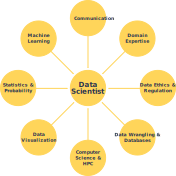
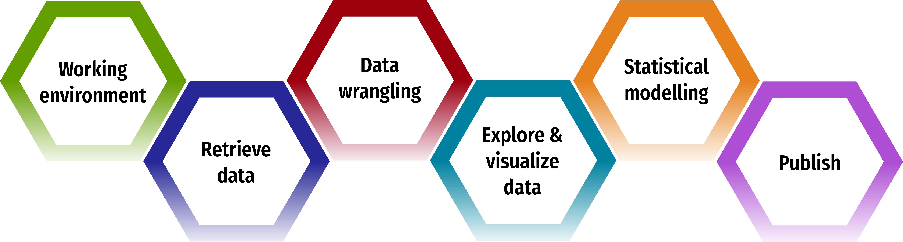
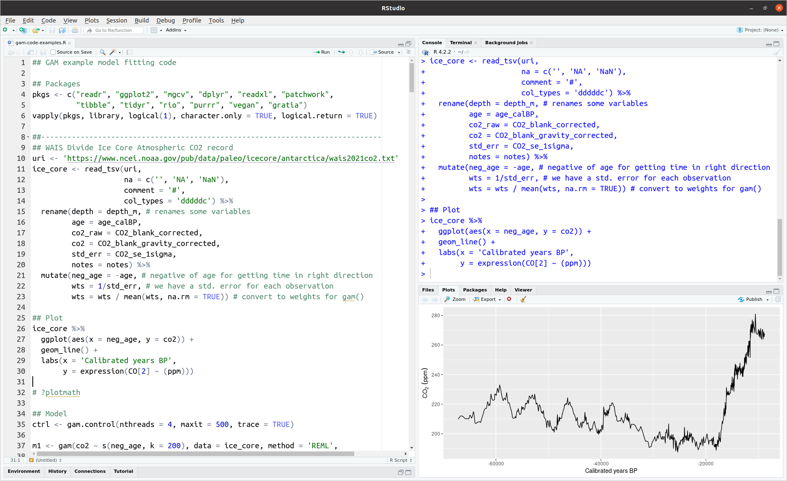

class: inverse middle center large-subsection

```{r setup, include=FALSE, cache=FALSE}
options(htmltools.dir.version = FALSE)
knitr::opts_chunk$set(cache = TRUE, dev = 'svg', echo = TRUE, message = FALSE, warning = FALSE,
                      fig.height=6, fig.width = 1.777777*6)
library('xaringanExtra')
```

```{r xaringan-tile-view, echo=FALSE}
xaringanExtra::use_tile_view()
```

# Data science

---
class: inverse subsection
background-image: url('resources/claudio-schwarz-fyeOxvYvIyY-unsplash.jpg')
background-position: center
background-size: contain

# 

---

# Data science skills

.row[

.col-12[
.center[

]
]
]

---

# Palaeo data science workflow

&nbsp;

.row[

.col-12[
.center[

]
]
]

---

# Workshop topics

.row[

.col-6[

* Introduction

* Palaeo Data Science

* Importing Data

* Data Wrangling

]

.col-6[

* Data Visualization

* Ordination

* Generalized Additive Models

* Transfer Functions

]
]

---

# Workshop materials

[gavinsimpson.github.io/acme-stats/](https://gavinsimpson.github.io/acme-stats/)

---

# Recommended text

.row[
.col-6[

* Lots of good R resources

* R for Data Science is recommended

* https://r4ds.had.co.nz/

]

.col-6[
.center[
```{r out.width = '370px', echo = FALSE}
knitr::include_graphics('./resources/r4ds-cover.png')
```
]
]
]

---

# Computing Environment

rstudio

.center[

]

