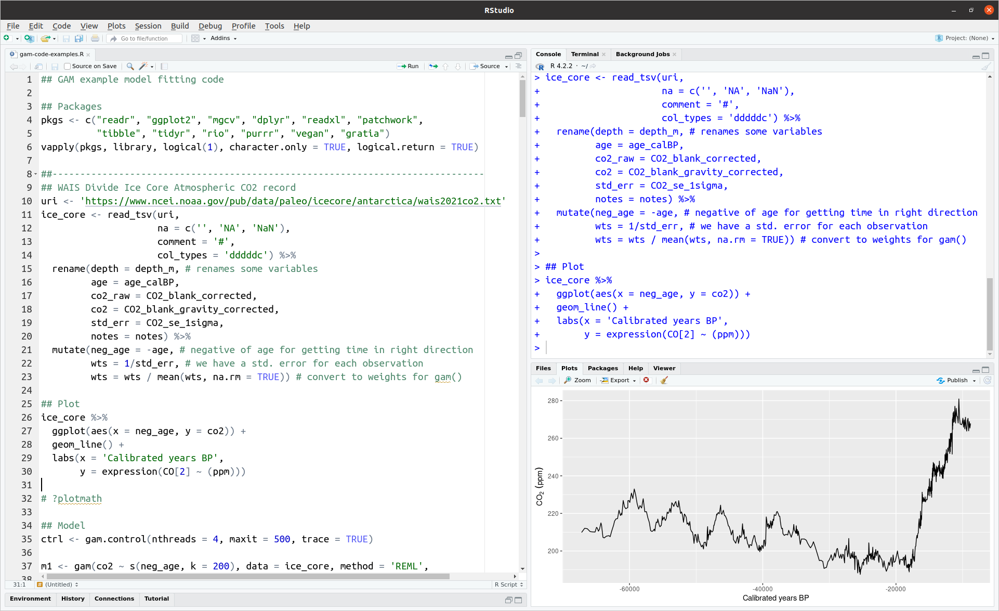

class: inverse middle center large-subsection

```{r setup, include=FALSE, cache=FALSE}
options(htmltools.dir.version = FALSE)
knitr::opts_chunk$set(cache = TRUE, dev = 'svg', echo = TRUE, message = FALSE, warning = FALSE,
                      fig.height=6, fig.width = 1.777777*6)
library('xaringanExtra')
library('kableExtra')
library("ggplot2")
library("readxl")

theme_set(theme_bw(base_size = 20, base_family = "Fira Sans"))

dinocyst <- read_excel("../data/dinocyst.xlsx", range = "A3:BT3")
```

```{r xaringan-tile-view, echo=FALSE}
xaringanExtra::use_tile_view()
```

# R and RStudio

---
class: inverse subsection
background-image: url('resources/mika-baumeister-J5yoGZLdpSI-unsplash.jpg')
background-position: center
background-size: cover

# 

---

# R

R is a powerful software application for statistical analysis

It is incredibly popular

* It is open source &mdash; GPL
* Vast package ecosystem
* Designed from the ground up for analysing data
* Has excellent graphics capabilities

R is an *interpreted* language unlike C, C++, etc

Slower but more forgiving and **interactive**

---

# RStudio

RStudio is a powerful *integrated development environment* (**IDE**) for R

* an interface for running R
* an editor for writing R scripts
* menus & buttons to run common tasks
* a lot more

It is also open source

RStudio &ne; R

Can run RStudio on your computer or in the cloud using [rstudio.cloud](https://rstudio.cloud)

Posit PBC provide paid-for support & Pro-level versions for organisations

---

# RStudio

.center[
```{r echo = FALSE}

```
]

---

# R example

```{r}
## Palmer penguins

library("palmerpenguins")
library("dplyr")
library("ggplot2")

theme_set(theme_bw())

penguins %>%
    count(species)
```

---

# R example

```{r}
penguins %>%
  group_by(species) %>%
    summarize(across(where(is.numeric), mean, na.rm = TRUE))
```

---

# R example

.row[
.col-6[
```{r penguins-plot, fig.show='hide'}
ggplot(penguins, aes(x = flipper_length_mm,
                     y = body_mass_g,
                     colour = species,
                     shape  = species)) +
  geom_point(size = 3) +
  scale_colour_brewer(palette = "Set1")
```
]

.col-6[
```{r penguins-plot, echo = FALSE}
```
]
]

---

# R example

Don't worry! You might not understand most of that!

By the end of the workshop you will

--

We start this journey here

---
class: inverse center middle big-subsection

# R basics

---

# Assignment

`<-` is the assignment operator

Made up from the `<` and `-` characters

`output <- input`

Assign the **result** of the *right hand side* to the object named on the left

This creates an object with name `output`

Refer to objects using their name

---

# Data types

The main data types in R are

.row[
.col-6[
* **numeric**

    * **integer**
	* **double** (real values)
	* **complex** (numbers with real & imaginary parts)
	
* **character**

    * strings of letters, numbers, etc
	* create with **matched** single `'` or double `"` quotes
]

.col-6[
* **logical**

    * `TRUE` and `FALSE`

    Never use `T` and `F` in their place!

    `TRUE` & `FALSE` are *reserved* words in R &mdash; can't be overwritten &mdash; but `T` and `F` aren't
	
```{r}
T <- FALSE # you monster!
T == TRUE
```
]
]

---

# Operators

As well as `<-` R has many operators

.row[
.col-6[
* **Mathematical**

    * `+`
	* `-`
	* `*`
	* `/`
]

.col-6[

* **Boolean**

    * `<` and `>`
	* `<=` and `>=` (`<` `=` & `>` `=`)
	* `==` (`=` `=`)
	* `!=` (`!` `=`)
	* `&` AND
	* `|` OR
	* `!` NOT
]

]

---

# Getting help

Can get help on R from many places

Inside R use `?topic` to get help on topic `topic`

Usually `topic` is a function

Can search more broadly with `??topic`

Other sources:

* Google
* StackOverflow <https://stackoverflow.com/>
* RStudio Community <https://community.rstudio.com/>

---
class: inverse middle center big-subsection

# Vectors

---

# Vectors

Vectors are the fundamental way that data are stored in R

R doesn't have **scalars** &mdash; single values &mdash;  just vectors

Vectors are a one-dimensional collection of values in a single unit

**Atomic** vectors are vectors whose elements are all of the same type

---

# Creating vectors

.row[

.col-6[
Create vectors with `c()` (for **combine**)

```{r}
numbers <- c(1, 4, 6, 10)
numbers
people <- c("Alice", "Bob", "Claire", "David")
people
```

Number of elements via `length()`

```{r}
length(people)
```
]

.col-6[
Many other ways: `seq()`, `rep()`

```{r}
seq(1, 5)
seq(1, 10, by = 2)
seq(1, 2, length = 5L)
rep(c(1,2), each = 2)
rep(c(1,2), times = 2)
```
]
]

---

# Vectorized operations

Vectors are a power feature of R as they allow us to write more expressive code

```{r}
v1 <- c(3, 1, 4, 1, 5)
v2 <- c(1, 6, 1, 8, 0)
v1 + v2
```

In other languages, to achieve this you might have to loop (iterate) over the *indices* of the vectors to add each pair of elements in turn

We'll talk more about **loops** and **iteration** later in the course

---

# Recycling

What if we have vectors of different lengths?
.row[

.col-6[
```{r, warning = TRUE}
v1 <- c(1, 3, 5, 1, 5)
v2 <- c(1, 2)
v1 + v2
```

`v2` is **recycled** until it is of the correct length

]

.col-6[
.center[
<i class="fas fa-recycle fa-10x fa-yellow"></i>
]
]

]

Dangerous & powerful &mdash; best avoided

Working with **data frames** helps avoid this


---

# Recycling

.center[
```{r, echo = FALSE, out.width = "65%"}

```
]

---

# Vectorized functions

Most functions in R accept vectors as inputs

```{r}
v1 <- c(10, 5, 2, 4)
sum(v1)
prod(v1)
length(v1)
round(v1 + runif(length(v1)), 2)
```

---

# Indexing vectors

Having stored data in a vector we might want to access certain elements of the vector

.row[

.col-6[

Use **&lsqb;** plus a vector of indices to access elements of a vector

```{r}
v1
```

Can also use **negative** indices to **exclude** those elements

]

.col-6[

```{r}
v1[1]
v1[4]
v1[length(v1)]
v1[2:3]
v1[-c(1,3)]
```

]

]

---

# Indexing vectors

If we give the elements of the vector **names** we can index using those

.row[

.col-6[

```{r}
names(v1) <- people
v1
```

]

.col-6[

```{r}
v1["Alice"]
people[2]
v1[people[2]]
```

]

]

---

# Indexing vectors

We can also use a logical vector to select (`TRUE`) or exclude (`FALSE`) elements

.row[

.col-6[

```{r}
v1
filt <- rep(c(TRUE, FALSE), each = 2)
filt
```

]

.col-6[

```{r}
v1[filt]
v1[!filt]
```

]

]

---

# Indexing vectors


.row[

.col-6[

Any expression that evaluates to 

* numeric (possibly negative)
* character (assuming named)
* logical

can be used to index a vector

```{r}
v1
```


]

.col-6[

Can also **assign** new values to elements

```{r}
v1[4] <- 15
v1
v1 < 10
v1[v1 < 10]
```

]

]

---
class: inverse middle center big-subsection

# Data frames

---

# What are data frames?

Data frames are R's equivalent of an Excel spreadsheet

Data are arranged in rows and columns

* rows &mdash; observations

* columns &mdash; variables

Data frames are really lists, where each component of the list is required to be a vector of the same length

Each column of the data frame can be of a difference type

---

# Creating data frames

Use the `data.frame()` function

```{r create-data-frame}
people <- data.frame(name   = c('Ada', 'Bob', 'Chris', 'Diya', 'Emma'),
                     height = c(64, 74, 69, 69, 71),
                     weight = c(135, 156, 139, 144, 152))
people
```

---

# Investigating data frames

There are many functions for working with data frames

Table 10.1 in PS4DS lists several

Useful functions include

* `head()`

* `tail()`

* `nrow()`

* `ncol()`

---

# Accessing data frames

Can appear complicated because data frames are lists and matrix-like objects

.row[

.col-6[
List access:

* `people$height`
* `people[['height']]`
* `people[[2]]`
* `people[2]`

Last one extracts a data frame (list) with 1 column

]

.col-6[

```{r access-df-list}
people$height
people[['height']]
people[[2]]
people[2]
```

]

]

---

# Accessing data frames

Matrix-like access

Can use:

* row names and column names &mdash; `people['Ada', 'height']`

* row & column number (index) &mdash; `people[2, 3]`

* mixtures &mdash; `people[2, 'height']`

* extracting one or more rows &mdash; `people[2, ]`

* extracting one or more columns &mdash; `people[, 'height']`

* Can use numeric, character, logical indices

---

# Access data frames

.row[

.col-6[
```{r df-access-matrix-like-1}
rownames(people) <- people$name
people['Ada', ]
people[, 'height']
```
]

.col-6[
```{r df-access-matrix-like-2}
people[, c('height','weight')]
people[2:4, ]
```
]

]

---

# Tibbles

**Tibbles** are a modern implementation of the data frame concept

Widely used in the *Tidyverse* &mdash; a collection of packages that all share common philosophy and approaches to working with data

Coerce a data frame to be a tibble with `as_tibble()` (from **tibble** 📦)

Load data directly to tibbles using the **readr**, **vroom**, & **readxl** 📦📦📦

---

# Tibbles

```{r print-tibble}
people <- tibble::as_tibble(people)
people
```

---

# Tibbles

.smaller[
```{r print-big-tibble}
dinocyst
```
]

---

# Tibbles

There are some differences

* `people$name` extracts a vector as usual but *never* partial matches &mdash; `people$nam` is an error

* `people[ , 'height']` extracts a 1-column data frame &mdash; `[r, c]` *never* drops empty dimensions

* tibbles are much faster for large data sets

* tibbles print differently &mdash; never again swamp your R session by accidentally printing a large data frame

---
class: inverse middle center big-subsection

# Functions

---

# Functions

A **function** is

1. a sequence of 1 or more **instructions** (lines of code)
2. takes 0 or more arguments
3. returns something (possibly nothing or `NULL`, may be invisibly)

`seq()`, `length()` etc are all functions

---

# Arguments

Functions *typically* take arguments &mdash; like **flags** for the CLI commands

```{r}
v <- runif(n = 5)

round(v, digits = 1)
```

`n` is an argument to `runif`

`digits` is an argument to `round`

```{r}
args(round)
```

---

# Arguments

Arguments can be matched by **name** or **position**

```{r}
round(x = v, digits = 1)
round(v, 1)
round(digits = 1, x = v)
round(1, v) # wrong! But not an error
```

<i class="fas fa-lightbulb fa-yellow fa-tip"></i> **Don't name the first argument but name everything else**

---

# Packages

R comes with a lot of functions

* implement the language for programming
* utilities
* mathematical
* basic & advanced statistical

But it's not comprehensive

R **packages** extend R with new functions that implement new statistical methods, utilities, or even entirely new *domain specific languages*

R packages are user-written and work just like those provided with R

---

# Packages

Packages are typically **installed** from CRAN

**C**omprehensive **R** **A**rchive **N**etwork

Packages are installed on to a computer into a **library**

Install a packages using

```{r, eval = FALSE}
install.packages("pkg_name")
```

Load a package each time you want to use it with

```{r eval = FALSE}
library("pkg_name")
```

(Other repos are available, like **GitHub**, esp for development versions)

